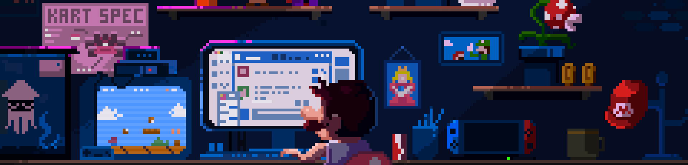

<!-- banner stays the same -->

<h1 align="center">Hello 👋, I'm Garv Singh Tomar</h1>
<h3 align="center">Full-Stack Engineer (MERN/Next.js) • AI/ML & Cloud Enthusiast • Building Interactive Web Experiences</h3>

  <!-- TODO: replace GITHUB_USERNAME with your actual GitHub handle -->
  

- 🔭 <strong>Currently Working On</strong>: Learning more about AI and making my work public.
- 🌱 <strong>Currently Learning</strong>: ML/AI fundamentals (supervised/unsupervised, vector search), AWS architecture patterns, System Designing
- 💬 <strong>Ask Me About</strong>: Frontend (React/Next.js), Backend (Node/Express), AI integrations (LLMs, prompts, retrieval), Cloud (AWS), gRPC  
- 📫 <strong>Reach Me At</strong>: <a href="mailto:singhtomargarv@gmail.com">singhtomargarv@gmail.com</a>

---

<h3 align="left">Connect with Me:</h3>

  
  <!-- Optional: keep a second link (same visual style) -->
  <!-- TODO: replace YOUR_LEETCODE (or switch to Medium link/icon if you prefer) -->
  

---

<h3 align="left">Languages and Tools:</h3>

  
  
  
  
  
  
  
  
  
  
  
  
  
  
  
  
  
  

---

<picture>
  <source media="(prefers-color-scheme: dark)" srcset="https://raw.githubusercontent.com/tanwar-harsh/tanwar-harsh/output/github-snake-dark.svg" />
  <source media="(prefers-color-scheme: light)" srcset="https://raw.githubusercontent.com/tanwar-harsh/tanwar-harsh/output/github-snake.svg" />
  
</picture>
